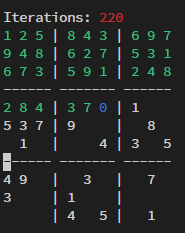

# Sudoku Solver

This is a command line Sudoku Solver using Python with Backtracking
Unlike most, this does not use recursive functions (I didn't realize that was a thing), but instead uses a list as a stack to do backtracking.

## Usage

#### sudoku.py

usage: sudoku.py [-h] [-v] file

Sudoku Solver using Backtracking

| positional arguments |                                 |
| -------------------- | ------------------------------- |
| file                 | Textfile containing sudoku data |

| optional arguments: |                                 |
| ------------------- | ------------------------------- |
| -h, --help          | show this help message and exit |
| -v, -visual         | Visual solver                   |

#### Input format

The input text files must be a file with 81 digits.
All data except digits will be stripped out, thus formatting doesn't matter.

Example [s14c.txt](/samples/s14c.txt)
```
1 0 0 8 4 3 0 0 0 
0 0 8 0 2 7 0 3 1 
6 0 0 0 0 0 0 0 0 
0 0 4 3 0 0 1 0 0 
5 3 7 9 0 0 0 8 0 
0 1 0 0 0 4 3 0 5 
4 9 0 0 3 0 0 7 0 
3 0 0 1 0 0 0 0 0 
0 0 0 4 0 5 0 1 0 
```

The specific formatting with linebreaks is not needed, but helps. Styling (and included samples) taken from http://lipas.uwasa.fi/~timan/sudoku/


#### Visual Solver



The visual solver will give a nice visual view of what the solver actually does. This do however significantly slow  down the solving process by many orders of magnitude. A solve that normally takes a few fractions of a second. With the visualization on this can take upwards to a minute.

The visual solver is not intended to have a functional use, but is more for entertainment.
